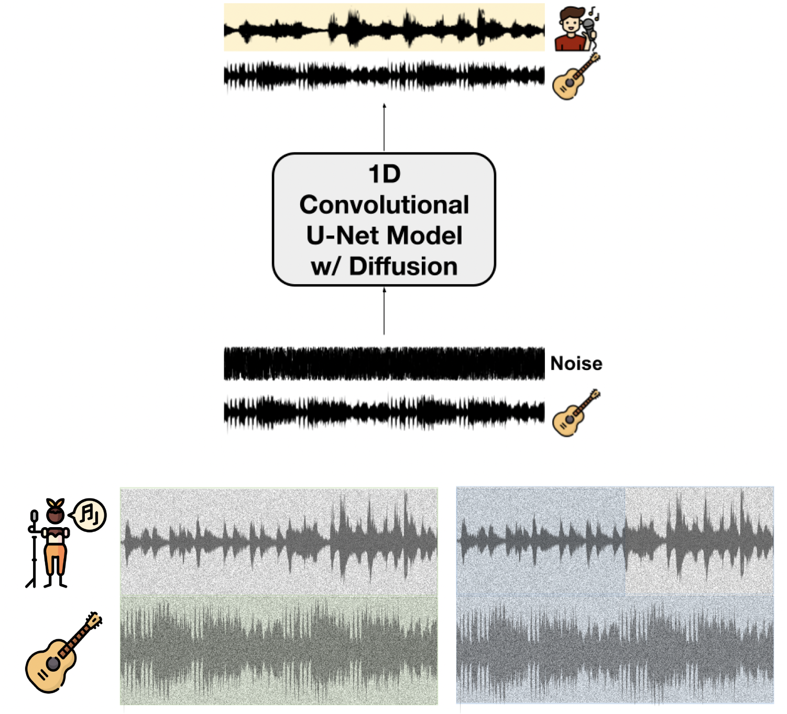

# AI618 Project - AI Topliner (ToplAIner)
* This is a project repository for 2024 Spring AI618 course



## Requirements
  * Install python 3
  * Install pytorch 
    ```
    torch==2.0.0
    torchaudio==2.0.1
    torchvision==0.15.1
    ```
  * Install requirements:
    ```
   	pip install -r requirements.txt
   	```

## Data
* you can download our collected dataset for training [here](https://drive.google.com/drive/folders/1Ky-d5U4-vyAcZLOu9qBhU7Uy8ZakHX2Q?usp=share_link)
* Dataset files should be placed at feature/inpainting/mackenzie_unet_diffusion_inpainter_audio/ directory
* download segments also [here](https://drive.google.com/drive/folders/1-Co1OMLdwCXzcD74nRKG-ExWWpfdZe_Q?usp=share_link)
* segment folder should be placed at the project directory as segments/mackenzie_norm/vocal/
* download groundtruth also [here](https://drive.google.com/drive/folders/1t4Elo6Gf2X4e9qP3cgXMlnbIG4QsQjXg?usp=share_link)
* segment folder should be placed at the project directory as segments/mackenzie_norm/vocal/

## Pretrained ToplAIner model
* download pretrained ToplAIner model [here](https://drive.google.com/file/d/1-7bj5UP2gtV3bQppHDW4BDzk01xK_EtO/view?usp=share_link)
* Locate the pretrained model at save/checkpoints/inpainting/mackenzie_unet_diffusion_inpainter_audio/2024-05-31-11-27-56/ directory

## Pretrained phoneme classifier for inference
* First, clone the repository
```
cd utils/evaluation
git clone https://github.com/seyong92/phoneme-informed-note-level-singing-transcription.git
mv phoneme-informed-note-level-singing-transcription phoneme_informed_note_level_singing_transcription
```
* checkpoint can be obtained [here](https://github.com/seyong92/phoneme-informed-note-level-singing-transcription)
* Locate the pretrained model at utils/evaluation/phoneme_informed_note_level_singing_transcription/checkpoints/ directory

## Training the network
* Train the network based on configurations inside configs/diffusion_unet.yml
```
python3 trains/unet_diffusion_inpainter/train.py
```

## Infer the network
* Generate samples based on pretrained model
```
python3 infers/unet_diffusion_inpainter/infer_checkpoint.py
```
## Others
* mdx/ is for source separation

## Reference
  * seyong92 : https://github.com/seyong92/phoneme-informed-note-level-singing-transcription
